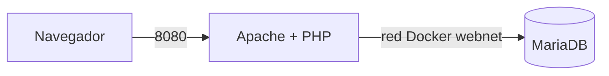

# 🕹️ Salón Recreativo ---- HUGO FERNÁNDEZ GARCÍA
## 1. Descripción del stack y las tecnologías
- **Apache** como servidor web.
- **PHP 8.3** como intérprete del lado servidor.
- **MariaDB 11.4** como sistema gestor de bases de datos.
- **JavaScript** para el código que se ejecuta en el navegador.
- **Docker y Docker Compose** para crear y ejecutar los contenedores.
- **Git y GitHub** para el control de versiones.

## 2. Diagrama de arquitectura

## 3. Comandos de despliegue local
### Construir y arrancar los contenedores
docker compose up -d --build

### Comprobar el estado de los servicios
docker compose ps

### Abrir la aplicación
http://localhost:8080

### Entrar en MariaDB
docker compose exec db mariadb -u jugador -p arcade

### Detener los contenedores
docker compose down

### Detener los contenedores y eliminar también el volumen
docker compose down -v

# 4. Preguntas
## 1. ¿Por qué no le pasamos al servicio web la contraseña de root de la base de datos?
No le pasamos la contraseña de `root` porque la aplicación no necesita permisos administrativos completos sobre MariaDB.
La aplicación solamente necesita acceder a la base de datos `arcade`, por lo que utiliza el usuario `jugador`.
Así se aplica el principio de mínimo privilegio. Si la aplicación web fuese comprometida, no tendría acceso como administrador a toda la base de datos.

## 2. SHOW GRANTS ¿Por qué no usamos root desde la aplicación?
+--------------------------------------------------------------------------------------------------------+
| Grants for jugador@%                                                                                   |
+--------------------------------------------------------------------------------------------------------+
| GRANT USAGE ON *.* TO `jugador`@`%` IDENTIFIED BY PASSWORD '*A356898222BAFD89977F71C95D215C9E30B059A4' |
| GRANT ALL PRIVILEGES ON `arcade`.* TO `jugador`@`%`                                                    |
+--------------------------------------------------------------------------------------------------------+

### ¿Sobre qué base de datos tiene permisos el usuario jugador?
Por tanto, el usuario jugador tiene permisos sobre la base de datos:
arcade

### ¿Por qué no usamos root desde la aplicación?
No usamos root porque tiene permisos administrativos completos.
Es más seguro utilizar un usuario específico como jugador, que solo tiene acceso a la base de datos que necesita la aplicación.

## 3. ¿Por qué no instalar la extensión mysqli a mano dentro del contenedor?
Porque ese cambio se perdería al eliminar o recrear el contenedor.

# 5. Monedas
## 1 Moneda 🪙
ARC-7X3K

## 2 Moneda 🪙🪙
ARC-Q9M2

## 3 Moneda 🪙🪙🪙
curl -I http://localhost:8080
docker compose ps

## 6. Problemas que me encontré y cómo los resolví
### Problema: Apache y PHP mostraban sus versiones
Al ejecutar:
curl -I http://localhost:8080

aparecía:
Server: Apache/2.4.68 (Debian)
X-Powered-By: PHP/8.3.33

Esto no cumplía el apartado de seguridad.
Lo solucioné añadiendo al Dockerfile:
RUN printf "ServerTokens Prod\nServerSignature Off\n" > /etc/apache2/conf-available/zz-security.conf \
    && a2enconf zz-security
RUN printf "expose_php=Off\n" > /usr/local/etc/php/conf.d/security.ini

Después reconstruí la imagen:
docker compose up -d --build

Finalmente:
curl -I http://localhost:8080

mostró únicamente:
Server: Apache

sin revelar las versiones.